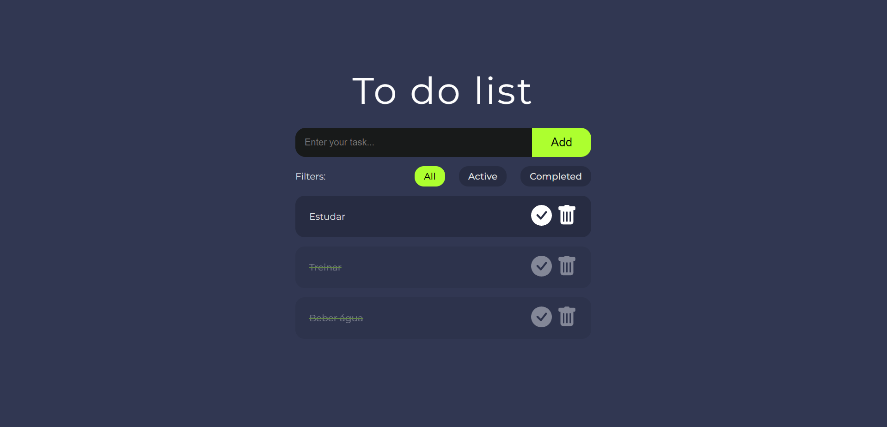

<h1 align="center">📝 To-Do List App 📝</h1>

  
  
  
  

  

  <i>Um aplicativo de lista de tarefas simples criado com React</i>

## 📖 Sobre o projeto

Este projeto é uma aplicação web simples de lista de tarefas criada com React Ele permite adicionar novas tarefas, marcar tarefas como concluídas, excluir tarefas e filtrar as tarefas por estado (todas, ativas ou concluídas).

## 🚀 Como executar o projeto

Para executar o projeto, siga estas etapas:

1. Clone o repositório em sua máquina local
2. Abra o terminal e navegue até o diretório do projeto
3. Execute o comando `npm install` para instalar as dependências
4. Execute o comando `npm start` para iniciar o aplicativo

## 🤝 Contribuição

Contribuições são bem-vindas! Para contribuir com este projeto, siga estas etapas:

1. Faça um fork deste repositório
2. Crie uma branch com sua funcionalidade (`git checkout -b minha-funcionalidade`)
3. Faça um commit de suas alterações (`git commit -m 'Adicionando minha funcionalidade'`)
4. Faça um push para a branch (`git push origin minha-funcionalidade`)
5. Abra um pull request

## 📝 Licença

Este projeto está licenciado sob a licença MIT - veja o arquivo [LICENSE.md](LICENSE.md) para detalhes.

## 📬 Entre em contato

- Linkedin: [@lucasadsr](https://www.linkedin.com/in/lucasadsr/)

---
Feito por [Lucas Araújo](https://www.linkedin.com/in/lucasadsr/)
